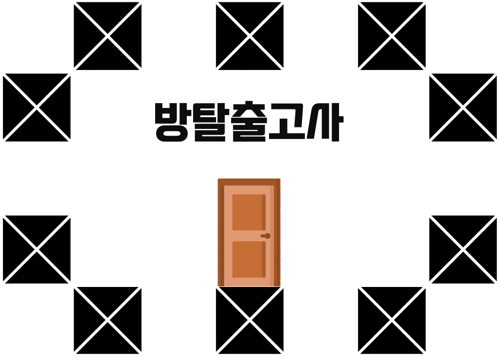
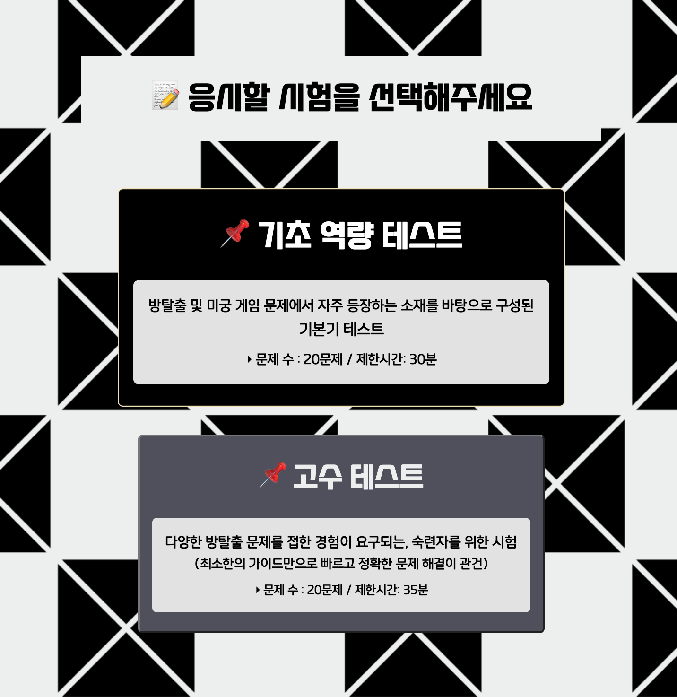
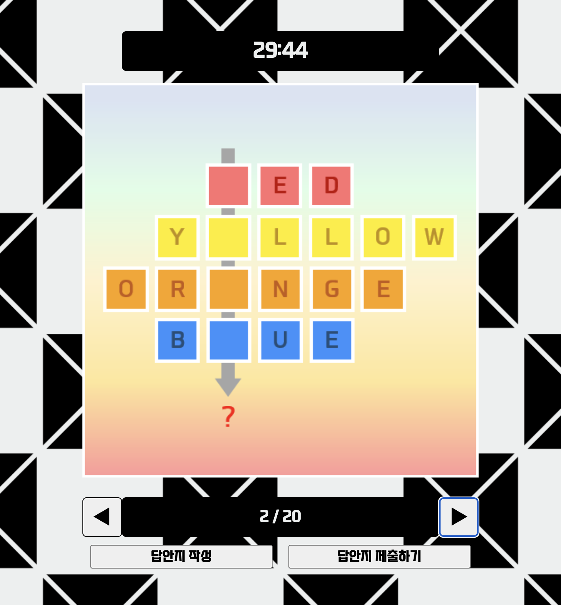

# 🚪 방탈출고사 - 모두를 위한 온라인 방탈출 테스트

 

<a href="https://roomescapetest.swygbro.com/" target="_blank">🎮 플레이 하러 가기</a>

  

## 📑 프로젝트 소개

- 초보부터 고수까지, 방탈출 혹은 미궁게임을 좋아하는 모든 사람들을 위한 '방탈출 능력 미니 테스트' 웹 앱입니다.

- 방탈출 문제 및 미궁 게임 제작자 SYL의 공식 7번째 작품입니다.

  <a href="https://superb-ranunculus-46a.notion.site/cb0658883e874aa6b9414d8da7c8aefa">👉 제작자의 다른 작품 보러가기</a>

- SWYG에서 주최한 스터디 'SWYDY(스위디)'에서 진행했던 개인 프로젝트입니다.

- 📆 개발 기간 : 2023.05.15 ~ 2023.05.30

 

&nbsp;&nbsp;&nbsp;&nbsp;&nbsp;&nbsp;

 

⭐️ **재밌게 플레이해주세요!** ⭐️

  

## 💰 프로젝트 성과

- 총 방문자 수 **1만명** 이상, 일일 평균 방문자 수 **약 20~50명**

- 광고 수익 **3만원 이상**, 개인 후원 수익 **2만원**

- 경북대학교에서 진행한 수학 멘토링 프로그램에서 해당 프로젝트의 콘텐츠가 소개되었음

  

## 🛠️ 기술 스택

#### Development

 
<strong>✅ 버전 : ReactJS(v18.2.0), styled-components(v5.3.10)</strong>

#### Environment

#### Config

#### Etc

  

## 📦 주요 기능

### ■ 테스트 선택 기능

- '기초 역량 테스트'와 '고수 테스트' 둘 중 하나 선택해서 응시 가능

### ■ 테스트 타이머 기능

- 타이머의 남은 시간이 0이 될 시, 테스트 자동 종료 및 답안지 자동 제출

### ■ 시험 중 문제 이동 기능

- 버튼을 통해 문제 번호를 앞 혹은 뒤로 이동할 수 있도록 구현

- 문제 번호 1번과 20번을 연결하여, 1번에서 20번으로, 20번에서 1번으로도 이동이 가능하도록 설정

### ■ 답안지 작성 기능

- 시험 중 답안을 작성할 수 있도록 구현

  (답안지에 Toggle 기능을 달아 열고 닫을 수 있도록 함)

- 시험 종료 시 답안지를 결과 페이지로 전송

### ■ 답인지 제출 시, 경고 메세지를 모달창으로 표시해주는 기능

- React의 Modal 컴포넌트를 이용하여 구현

  (`prompt` 창을 사용하지 않은 이유 : `prompt` 창이 뜨는 동안 타이머가 일시 정지 하므로)

### ■ 자동 채점 기능 및 채점 결과 표시 기능

- 답안지의 답과 실제 정답을 비교하여 채점을 진행한 후, 최종 점수와 틀린 문제 번호 등의 정보를 결과 화면에 표시

### ■ 시험 도중 새로고침, 뒤로가기 방지 기능

- `beforeunload` `unload` 이벤트를 처리하여 구현

  

## ✅ 업데이트 사항

#### 개발 직후 (2023.05.30 ~ 2023.06.15)

- UI 개선 - 사용자의 화면을 고려한 광고 위치 수정
- 문제 오류 수정 ('고수 테스트' 16번)

#### 2023.08.27

- 새 컨텐츠 '중급 능력 테스트' 업데이트

#### 2023.11.09

- UX 개선 - 사용자의 피드백을 통해 정답 입력 방식 개선
- '중급 능력 테스트' 제한시간을 30분에서 25분으로 단축

  

## 블로그 회고록

- **Part 1 : 기술적인 측면** 👉 https://sylagape1231.tistory.com/124
- **Part 2 : 콘텐츠적 측면** 👉 https://sylagape1231.tistory.com/125

  

## 라이센스

MIT © SangYoonLee

 
